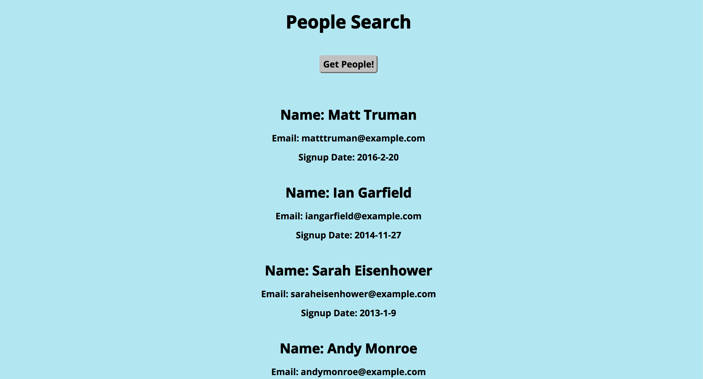

*Nutshell Rest API*

This is an application that generates the five most recent people (by signup date) from a Nutshell API. When the user clicks on the button, the program goes through the data and returns the name, email, and signup date for each of these five people and nobody else. The app is built with a Node and Express backend and a jQuery and JavaScript frontend.

*To run locally:*

* Clone down this repo.
* `npm install`
* `npm run dev`
* Go to `http://localhost:3000/` in a browser.

*Testing:*

The application is tested using Supertest for route tests and Selenium Webdriver for feature tests. The tests cover whether the endpoints are valid, whether the endpoints are returning the correct data, and whether the correct data is populating on the page when the user clicks the main button, as well as shallower details such as whether the correct button initially shows up on the page.

To run the tests:

* Follow steps 1 and 2 from the *To run locally* section above.
* `npm run test` or `mocha`.
* 10 passing tests should appear in your terminal window. Selenium Webdriver will also open up a Chrome window each time you run the tests, since it uses this window for automated testing.
* Note: the final App test, `should serve the correct data when the user presses the Get People button`, only returns one pass or fail indicated; however, this is a quite complex test that tests many conditions. See the corresponding test in the `feature-tests.js` file for details.
